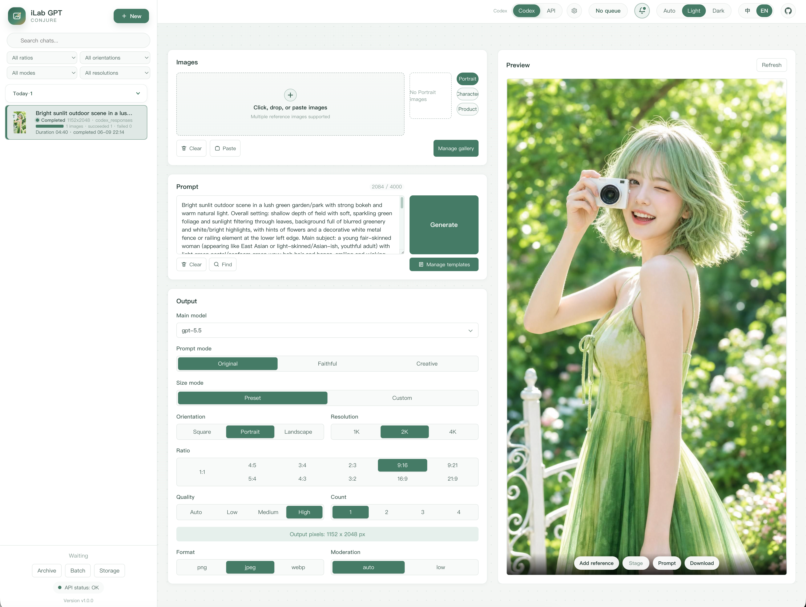

<h1 align="center">iLab GPT Conjure</h1>

<p align="center">
  <sub>GPT-image-2 WebUI workbench · Codex Responses / OpenAI-compatible API · Gallery, chips, templates, and concurrent tasks.</sub>
</p>

<p align="center">
  <a href="https://github.com/kadevin/ilab-gpt-conjure/releases"></a>
  <a href="https://github.com/kadevin/ilab-gpt-conjure/actions/workflows/ci.yml"></a>
  <a href="https://github.com/kadevin/ilab-gpt-conjure/commits/main"></a>
  <a href="https://github.com/kadevin/ilab-gpt-conjure/stargazers"></a>
  <a href="https://github.com/kadevin/ilab-gpt-conjure/network/members"></a>
</p>

<p align="center">
  
  
  
  
  
  
</p>


<p align="center">
  English · <a href="README.md">中文</a> · <a href="RELEASES.md">Downloads / Releases</a>
</p>

<p align="center">
  
</p>

## Overview

iLab GPT Conjure is an AI image generation WebUI workbench for GPT-image-2, with
a companion CLI for local automation. It supports both Codex Responses and
OpenAI-compatible API access, and includes shared gallery references, multi-type
quick chips, prompt templates, concurrent tasks, and local queue management.

The recommended public integration path is OpenAI-compatible API mode, using
the Images API or Responses API shape provided by your configured provider.

Download portable packages from [Downloads / Releases](RELEASES.md).

## Features

- GPT-image-2 text-to-image, reference-image generation, and image editing
  workflows.
- Codex Responses and OpenAI-compatible API access, with the API path
  recommended for public or shared use.
- Concurrent task execution, local queue state, history, thumbnails, and result
  archive.
- Shared gallery references, recent reference images, color chips, prompt
  snippet chips, and reusable prompt templates.
- Chinese / English WebUI localization with a top-bar language switch and a
  browser-local language preference.
- Advanced local OAuth mode for personal Codex workflows, with clear risk
  warnings and no account-usage probing.
- API provider profiles with configurable base URL, API key, image model, API
  mode, and concurrency.
- CLI support for generation, image references, image edits, masks, and dry runs.

## Authentication modes

### Recommended: OpenAI-compatible API

Use this mode for stable integrations, shared workstations, team deployments, or
anything that may become a public service. Configure the provider in the WebUI
with a base URL, API key, model name, and API mode.

### Advanced local mode: Codex / ChatGPT OAuth

This project can optionally reuse a local Codex / ChatGPT OAuth session to call
an internal ChatGPT backend endpoint. This mode is provided for local personal
workflows only.

It is not an officially recommended OpenAI API integration path. The endpoint
may change without notice, may stop working, and may be subject to account,
product, or usage restrictions. For stable integrations, production usage,
shared deployments, or public services, use OpenAI-compatible API mode instead.

Never commit OAuth files, API keys, local inputs, generated outputs, task
metadata, SQLite databases, or debug logs.

## Requirements

- Python 3.11 or newer.
- WebUI dependencies from `requirements-webui.txt`.
- Optional frontend tooling from `package.json` when editing TypeScript or CSS.

## Install

```bash
git clone https://github.com/kadevin/ilab-gpt-conjure.git
cd ilab-gpt-conjure
python3 -m venv .venv
.venv/bin/python -m pip install -r requirements-webui.txt
```

## Start the WebUI

macOS:

```bash
open "Start WebUI.command"
```

Windows:

```text
Start WebUI.bat
```

Manual:

```bash
.venv/bin/python -m uvicorn codex_image.webui.app:app --host 127.0.0.1 --port 8787 --no-access-log
```

Then open:

```text
http://127.0.0.1:8787/
```

## Portable packages

Download the current portable packages from [Downloads / Releases](RELEASES.md),
or open [GitHub Release v0.2.0](https://github.com/kadevin/ilab-gpt-conjure/releases/tag/v0.2.0)
directly.

These packages are intended for users who want a ComfyUI-style unzip-and-run
experience:

1. Download the portable zip for your platform from the release page.
2. Extract it into a normal user directory.
3. Run `Start WebUI Portable.bat` on Windows, or double-click
   `Start WebUI Portable.command` on macOS.
4. Open `http://127.0.0.1:8787/` if the browser does not open automatically.

The portable package contains bundled CPython, installed WebUI dependencies,
the app source, license files, and a local `data/` directory for settings,
gallery files, inputs, outputs, task databases, and logs.

Choose `macos_portable_arm64` for Apple Silicon Macs and
`macos_portable_x64` for Intel Macs.

The macOS packages are unsigned portable zips, not signed `.app` bundles or
notarized DMGs, and they do not require an Apple Developer account to build.
The launcher tries to remove quarantine attributes from its own extracted folder
before starting the bundled Python framework. If macOS still blocks the launcher
after download, right-click or Control-click `Start WebUI Portable.command`,
choose Open, then confirm Open again in the macOS security prompt. You can also
remove quarantine from the extracted folder:

```bash
xattr -dr com.apple.quarantine /path/to/ilab-gpt-conjure_macos_portable_arm64
# or:
xattr -dr com.apple.quarantine /path/to/ilab-gpt-conjure_macos_portable_x64
```

Do not commit portable package contents back to Git. API keys, OAuth files,
local inputs, generated outputs, SQLite databases, and logs must stay local.

Release packaging is intentionally separate from CI: the `Portable Release`
workflow runs only after the `CI` workflow has completed successfully on a push
to `main`, then uploads the zip and SHA256 file as workflow artifacts. If the
commit is tagged with a `v*` tag, the same assets are uploaded to that GitHub
Release. For a tagged commit that already passed CI, the same workflow can also
be run manually with `ref` and `release_tag`.

## WebUI usage

1. Choose an authentication source from the top bar. Use `API` for the
   recommended OpenAI-compatible mode, or the advanced local OAuth mode only for
   a personal local workflow.
2. Add reference images by upload, drag-and-drop, paste, recent uploads, or the
   public gallery.
3. Write the prompt directly, insert gallery/color/snippet chips when useful,
   and choose the prompt mode: original, fidelity, or creative.
4. Set image count, size, orientation, quality, output format, and compression.
5. Start generation, track running and queued tasks in the left task list, then
   review, select, retry, download, or archive results from the preview area.

## Public gallery

The public gallery is a local reusable reference library for people, characters,
products, brand assets, style references, and any image you want to reuse.

- Save uploaded images, recent uploads, or generated results into the gallery.
- Manage images in the right-side gallery drawer with categories, names, prompt
  roles, reference notes, replacement images, deletion, and drag sorting.
- Insert a gallery image into the current task from the gallery drawer or by
  typing `@` in the prompt editor.
- Gallery files stay local. Do not commit `input/`, `inputs/`, `output/`, or
  `outputs/`. If a gallery item is later deleted, older tasks may show a missing
  reference.

## Prompt chips

The prompt editor supports three atomic chip types:

- `@` gallery chip: searches the public gallery, inserts the selected image into
  reference inputs, and adds visible reference notes for the model.
- `#` color chip: inserts a hexadecimal color value such as `#FF6600`; useful
  for product, poster, brand, material, or background color constraints.
- `~` snippet chip: inserts a saved prompt snippet by short tag. The editor keeps
  the short tag visible, while the model prompt expands it to the full snippet
  content.

Snippet chips can be created from selected prompt text and can later be viewed,
expanded into plain text, edited, or reused with `~`, `～`, or common tilde
variants.

## Prompt templates

Prompt templates are for longer reusable prompt structures, not short inline
phrases. They are stored locally in `output/webui-prompt-templates.json`.

Use `Manage Prompt Templates` in the prompt area to search, filter by category,
favorite, create, edit, copy, insert, replace, import, or export templates.
Templates can use small thumbnails from historical results as visual cues.

Inserting a template writes into the visible prompt editor. Replacing a template
overwrites the visible prompt text. Templates are not injected as hidden prompts.

## CLI

```bash
.venv/bin/python -m codex_image --prompt "A clean product photo of a ceramic mug" --out output/mug.png
```

Use `--help` for all CLI options.

## Development

```bash
.venv/bin/python -m unittest discover -s tests -v
npm run check:webui
```

When changing frontend TypeScript or CSS, commit the generated browser assets in
`codex_image/webui/static/`.

GitHub CI runs the Python test suite and WebUI frontend checks on pull requests
and pushes to `main`. Release packaging should run only after CI succeeds.

## License

This project is licensed under GNU AGPLv3. See `LICENSE`.

If you modify this software and make it available to users over a network, you
must also make the corresponding source code available under the same license.

This license applies to the software code. It does not grant rights to the
project name, logo, personal assets, API credentials, user prompts, input
images, output images, or model/API services used with the software.

## Contact

Feel free to connect on WeChat to discuss AI programming, AI image generation,
and local image generation workflows.

<p align="center">
  
</p>
