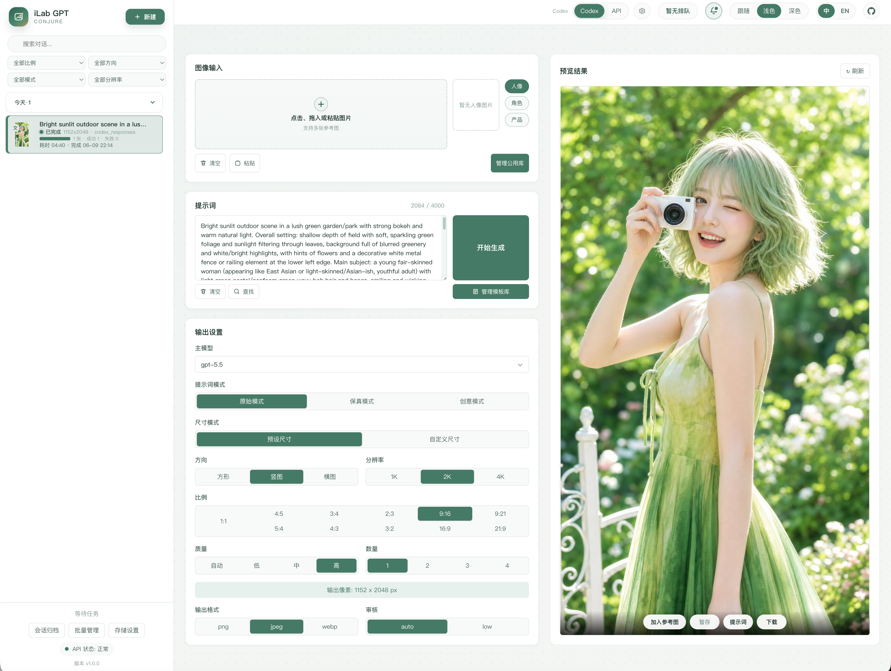

<h1 align="center">iLab GPT Conjure</h1>

<p align="center">
  <sub>GPT-image-2 WebUI 工作台 · Codex Image / OpenAI 兼容 API · 图库、模板、历史库与并发任务</sub>
</p>

<p align="center">
  <a href="https://github.com/kadevin/ilab-gpt-conjure/releases"></a>
  <a href="https://github.com/kadevin/ilab-gpt-conjure/actions/workflows/ci.yml"></a>
  <a href="https://github.com/kadevin/ilab-gpt-conjure/commits/main"></a>
  <a href="https://github.com/kadevin/ilab-gpt-conjure/stargazers"></a>
  <a href="https://github.com/kadevin/ilab-gpt-conjure/network/members"></a>
</p>

<p align="center">
  
  
  
  
  
  
</p>


<p align="center">
  中文 · <a href="README.en.md">English</a> · <a href="RELEASES.md">下载 / Releases</a>
</p>

<p align="center">
  
</p>

## 简介

iLab GPT Conjure 是面向 GPT-image-2 的 AI 图片生成 WebUI 工作台，同时
提供 CLI 便于本地自动化。它支持默认 Codex Image 通道、Codex Responses
兼容通道与 OpenAI 兼容 API 接入，并内置公用图库、多类型 chip 快捷引用、
提示词模板、多任务并发、分页历史库和本地队列管理。

公开版推荐优先使用 OpenAI-compatible API 模式，通过你配置的供应商使用
Images API 或 Responses API 形态。

标准包和过渡期免安装一键包下载见 [下载 / Releases](RELEASES.md)。

## 功能

- 面向 GPT-image-2 的文生图、参考图生成和图像编辑工作流。
- 支持 Codex Image、Codex Responses 和 OpenAI 兼容 API 接入；公开或共享使用优先选择 API 模式。
- 多任务并发、本地队列状态、分页历史库、缩略图和结果归档。
- 独立 `/history` 页面支持 SQLite 分页、搜索、筛选、网格/列表视图和懒加载详情。
- Codex Responses 和 API Responses 生图可选启用联网搜索；生成页和历史库搜索支持提示词与任务 ID，并可命中历史任务。
- 单任务多图输出、部分失败处理和失败重试。
- 公用图库、最近参考图、颜色 chip、提示词片段 chip 和提示词模板。
- 图像编辑器支持插入输入框里的其他图片、多图层组合、默认锁定比例变换、
  Shift 自由变换、局部擦除和真实图层缩略图。
- 系统设置提供语言下拉菜单，支持简体中文、正體中文、繁体中文、日语、韩语、English、西班牙语、葡萄牙语、法语、德语、俄语、意大利语和印地语；首次启动自动跟随浏览器语言，手动选择后偏好保存在当前浏览器。
- 系统设置整合 API 设置、Codex 通道、语言 / Language、存储与通知四个 Tab；API 设置默认第一位。
- API 供应商以卡片快速选择，默认只读详情，支持显式编辑、复制、删除确认和多供应商排序。
- 标准 macOS DMG 和 Windows App ZIP 提供 Rust 托盘 / 菜单栏启动器、小兔子图标、系统语言跟随、原生关于窗口，并在首次启动时由用户确认复制旧 portable 数据。
- 过渡期 portable 包继续把数据保存在同级 `data/`，并支持用户确认后的自动替换更新；更新器读取带签名的 `latest.json` manifest、校验 Ed25519 签名和 SHA256、保留 `data/`，并把被替换文件备份到 `.backup/`。
- 高级本机 OAuth 工作流支持个人本地 Codex 使用，并明确提示接口风险。
- API 供应商配置，支持 Base URL、API Key、图像模型、调用方式和并发上限。
- CLI 支持生成、参考图、图像编辑、mask 和 dry-run。

## 认证模式

### 推荐：OpenAI-compatible API

稳定集成、团队使用、共享工作站或可能公开提供服务的场景，应使用 API 模式。
你可以在 WebUI 中配置 Base URL、API Key、模型名和调用方式。

### 高级本机模式：Codex / ChatGPT OAuth

本项目可选复用本机 Codex / ChatGPT OAuth 登录态，调用 ChatGPT 内部后端接口。
Codex 模式默认使用 Image 通道生成和编辑，也可在系统设置的 Codex 通道 Tab 切换到 Responses
兼容通道。该模式只面向个人本机工作流。

这不是 OpenAI 官方推荐的 API 集成方式。接口可能随时变更、失效，也可能受到
账号、产品或用量规则影响。生产环境、团队部署、公开服务或需要稳定性的场景，
应优先使用 OpenAI-compatible API 模式。

不要提交 OAuth 文件、API key、本地输入图、生成结果、任务 metadata、SQLite
数据库或调试日志。

## 环境要求

- Python 3.11 或更高版本。
- WebUI 依赖见 `requirements-webui.txt`。
- 修改 TypeScript 或 CSS 时需要 `package.json` 中的前端工具。

## 安装

```bash
git clone https://github.com/kadevin/ilab-gpt-conjure.git
cd ilab-gpt-conjure
python3 -m venv .venv
.venv/bin/python -m pip install -r requirements-webui.txt
```

## 启动 WebUI

macOS：

```bash
open "Start WebUI.command"
```

Windows：

```text
Start WebUI.bat
```

手动启动：

```bash
.venv/bin/python -m uvicorn codex_image.webui.app:app --host 127.0.0.1 --port 8787 --no-access-log
```

然后打开：

```text
http://127.0.0.1:8787/
```

## 应用包下载

当前可用的标准包和一键包见 [下载 / Releases](RELEASES.md)，也可以直接打开
[GitHub Release v0.5.5](https://github.com/kadevin/ilab-gpt-conjure/releases/tag/v0.5.5)。

新用户建议优先下载标准包：

1. macOS：Apple Silicon 下载 `iLab-GPT-CONJURE-macos-arm64-0.5.5.dmg`，
   Intel 下载 `iLab-GPT-CONJURE-macos-x64-0.5.5.dmg`，然后把
   `iLab GPT CONJURE.app` 拖到 Applications。
2. Windows：下载 `iLab-GPT-CONJURE-windows-x64_0.5.5.zip`，
   解压到普通用户目录，双击 `iLab GPT CONJURE.exe`。

标准包的用户数据会写入 macOS 的
`~/Library/Application Support/iLab GPT CONJURE` 或 Windows 的
`%APPDATA%\iLab GPT CONJURE`。首次启动时，标准包可以检测相邻旧 portable
`data/`，并在用户确认后复制旧数据；旧目录不会被移动或删除，目标标准数据目录
已有 WebUI 数据时不会自动覆盖。

`v0.5.4` 及更早 portable 用户首次升级到 `0.5.5` 时，建议手动下载完整标准包或完整 portable 包；旧 updater 只保证升级 WebUI/依赖，不保证安装新的小兔子启动器、标准 `.app` / `.exe` 入口和迁移助手。

portable 包继续提供给老用户、调试用户，以及希望像 ComfyUI 一样“解压即用”的用户：

1. 从下载页选择对应平台的 portable zip。
2. 解压到普通用户目录。
3. Windows 双击 `Start iLab GPT CONJURE.exe`；macOS 双击
   `Start iLab GPT CONJURE.app`。旧的 `Start WebUI Portable.bat` /
   `Start WebUI Portable.command` 仍保留，用于终端调试。
4. 如果浏览器没有自动打开，手动访问 `http://127.0.0.1:8787/`。

一键包内包含打包好的 CPython、已安装的 WebUI 依赖、预构建的 WebUI 静态资源、
用于源码复构的前端 package 元数据和构建配置、应用源码、许可证文件，以及本地
`data/` 目录。设置、公用图库、输入图、输出图、任务数据库和日志都会写入 `data/`。

一键包启动脚本不会运行 `npm install`，也不会重建前端资源。只有你主动修改
TypeScript 或 CSS 并从源码重新生成 `codex_image/webui/static/app.js` 时，才需要
本机安装 Node.js。

一键包启动器不会后台自动访问 GitHub。更新已经解压的一键包时，可在托盘 / 菜单栏
菜单选择检查更新，并在发现新版本后确认 `安装更新`；也可以退出启动器后手动运行
Windows 的 `Update WebUI Portable.bat` 或 macOS 的 `Update WebUI Portable.command`。
更新脚本会读取带签名的 `latest.json`
manifest，先用启动器内置公钥校验 Ed25519 签名，再下载当前平台对应的最新
GitHub Release 资产，执行前显示所选资产和 manifest SHA256，校验下载 zip 的
SHA256，只替换一键包目录内由程序管理的文件，保留本地 `data/`，并把被替换文件备份到 `.backup/`。

Apple Silicon Mac 下载 `macos_portable_arm64`，Intel Mac 下载
`macos_portable_x64`。

0.5.5 的标准 macOS DMG 和 portable zip 都暂未签名、未 notarize。如果 macOS
拦截下载后的 App，可以右键或 Control-click App，选择 Open，并在系统安全提示里
再次确认 Open。portable zip 还可以对解压目录执行：

```bash
xattr -dr com.apple.quarantine /path/to/ilab-gpt-conjure_macos_portable_arm64
# 或：
xattr -dr com.apple.quarantine /path/to/ilab-gpt-conjure_macos_portable_x64
```

不要把一键包里的 Python、依赖、API key、OAuth 文件、本地输入图、生成结果、
SQLite 数据库或日志提交回 Git。

应用包打包和 CI 明确分离：`Portable Release` workflow 只会在 `CI` workflow 于
`main` push 上成功完成后运行，并生成标准包、portable 包和 SHA256 文件作为
workflow artifact。如果该提交带有 `v*` tag，release job 还会使用
`ILAB_CONJURE_UPDATE_SIGNING_PRIVATE_KEY_B64` secret 生成仅供 portable 自动更新使用的
signed `latest.json`，并把所有安装包、SHA256 文件与更新 manifest 上传到对应
GitHub Release。对于已经通过 CI 的 tag，也可以手动运行同一个 workflow，并填写
`ref` 与 `release_tag`。

## WebUI 使用说明

1. 在顶部选择认证来源。`Codex` 在本机 OAuth 可用时默认使用 Image 通道；
   稳定或共享使用建议选择 `API`，也就是 OpenAI-compatible API 模式。
2. 打开系统设置维护 API 供应商卡片、Codex Image/Responses 通道、界面语言、存储目录和通知偏好。
3. 添加参考图：支持上传、拖拽、粘贴、最近上传和公用图库。
4. 编写提示词：可直接输入文本，也可插入图库、颜色和片段 chip，并选择原始、
   保真或创意提示词模式。
5. 设置数量、尺寸、方向、质量、输出格式和压缩率。
6. 点击开始生成后，在左侧任务列表查看运行中和排队任务，在右侧预览区查看、
   精选、重试、下载、打包或归档结果；完整历史在 `/history` 中搜索和筛选。

## 公用图库（公共图库）

公用图库是本地可复用参考图资源库，适合保存固定人物、角色设定、产品主图、
品牌素材、风格参考和其他长期复用图片。

- 上传图、最近上传图和生成结果都可以保存到公用图库。
- 右侧图库抽屉支持分类、命名、提示词用途、引用备注、替换原图、删除和拖拽排序。
- 可在图库抽屉中直接使用图片，也可以在提示词编辑器里输入 `@` 搜索并插入。
- 图库文件只保存在本机。不要提交 `input/`、`inputs/`、`output/`、`outputs/`。
  如果后续删除图库条目，旧任务可能显示缺失引用。

## 三种 chip

提示词编辑器支持三种原子 chip：

- `@` 图库 chip：搜索公用图库，将选中的图片同步加入参考图输入，并为模型附加
  可见的参考图说明。
- `#` 颜色 chip：插入 `#FF6600` 这类十六进制颜色，适合约束商品、海报、品牌、
  材质或背景色。
- `~` 提示词片段 chip：用短标签插入常用提示词片段。编辑器保持短标签可见，
  提交给模型时会展开为完整片段内容。

提示词片段可以从选中文本收藏，之后可用 `~`、`～` 或常见波浪号变体再次调用；
chip 支持查看完整内容、展开为正文、编辑和复用。

## 提示词模板

提示词模板用于保存更长、可复用的生成结构，不是短句片段。模板默认保存在本机
`output/webui-prompt-templates.json`。

在提示词区域点击 `管理模板库`，可以搜索、按分类筛选、收藏、新建、编辑、复制、
插入、替换、导入和导出模板。模板可以从历史任务结果中选择小缩略图辅助识别。

插入模板会写入当前可见提示词；替换模板会覆盖当前可见提示词。模板不会作为隐藏
提示词注入。

## CLI

```bash
.venv/bin/python -m codex_image generate --prompt "A clean product photo of a ceramic mug" --out output/mug.png
```

更多参数请使用 `--help`。

## 开发

```bash
.venv/bin/python -m unittest discover -s tests -v
npm run check:webui
```

修改前端 TypeScript 或 CSS 时，先运行 `npm install` 安装 `package-lock.json`
锁定的前端构建依赖，包括图层编辑器使用的 Konva；再提交生成后的浏览器资源：
`codex_image/webui/static/`。

GitHub CI 会在 pull request 和推送到 `main` 时运行 Python 测试和 WebUI 前端检查。
后续 Release 一键包打包流程应接在 CI 成功之后。

## 许可证

本项目采用 GNU AGPLv3 协议。详见 `LICENSE`。

如果你修改本软件，并通过网络向用户提供服务，需要按照 AGPLv3 要求开放对应源码。

该许可证只适用于本项目代码，不授权项目名称、Logo、个人素材、API 凭据、用户
提示词、输入图、输出图，或软件调用的模型/API 服务。

## 交流与定制开发

欢迎添加微信交流 AI 编程、AI 生图和本地图片生成工作流经验。

也接受合适的定制开发需求：

- 定制软件工具：本地工作台、内部自动化、批量处理、数据看板和 AI 生产流程。
- 企业网站：企业官网、产品展示、活动落地页和轻量后台管理系统。
- 智能体网站：客服问答、知识库检索、内容生成和业务流程助手类 Web 应用。

扫码添加微信时，可以备注 `iLab GPT Conjure` 或 `定制开发`，方便快速对齐需求。

<p align="center">
  
</p>
