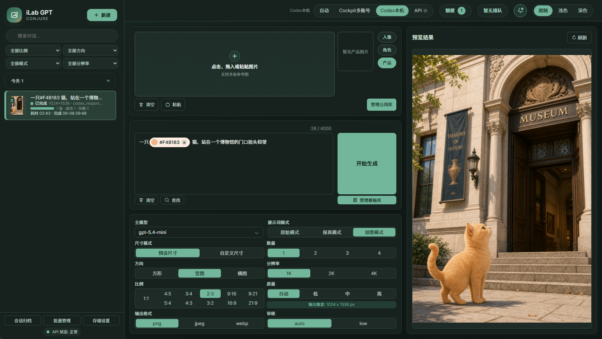

<h1 align="center">iLab GPT Conjure</h1>

<p align="center">
  <strong>本地优先的 AI 图片生成工作台，支持 WebUI、CLI、提示词模板和可复用参考图工作流。</strong>
</p>

<p align="center">
  <a href="https://github.com/kadevin/ilab-gpt-conjure/releases"></a>
  <a href="https://github.com/kadevin/ilab-gpt-conjure/actions/workflows/ci.yml"></a>
  <a href="https://github.com/kadevin/ilab-gpt-conjure/commits/main"></a>
  <a href="https://github.com/kadevin/ilab-gpt-conjure/stargazers"></a>
  <a href="https://github.com/kadevin/ilab-gpt-conjure/network/members"></a>
</p>

<p align="center">
  
  
  
  
  
  
</p>


iLab GPT Conjure 是一个本地优先的图片生成工作台，提供 WebUI 和 CLI，
面向提示词编写、参考图工作流、批量生成、任务队列和结果归档。

English: iLab GPT Conjure is a local-first AI image generation workbench for
prompt writing, reference image workflows, batch generation, task queues, and
result archiving.

公开版推荐优先使用 OpenAI-compatible API 模式，通过你配置的供应商使用
Images API 或 Responses API 形态。

免安装一键包下载见 [下载 / Releases](RELEASES.md)。

<p align="center">
  
</p>

## 语言

中文 | [English](README.en.md)

## 功能

- 文生图、参考图生成和图像编辑工作流。
- 本地任务队列、状态更新、历史记录、缩略图和结果归档。
- 单任务多图输出、部分失败处理和失败重试。
- 公用图库、最近参考图、颜色 chip、提示词片段和提示词模板。
- API 供应商配置，支持 Base URL、API Key、图像模型、调用方式和并发上限。
- CLI 支持生成、参考图、图像编辑、mask 和 dry-run。

## 认证模式

### 推荐：OpenAI-compatible API

稳定集成、团队使用、共享工作站或可能公开提供服务的场景，应使用 API 模式。
你可以在 WebUI 中配置 Base URL、API Key、模型名和调用方式。

### 高级本机模式：Codex / ChatGPT OAuth

本项目可选复用本机 Codex / ChatGPT OAuth 登录态，调用 ChatGPT 内部后端接口。
该模式只面向个人本机工作流。

这不是 OpenAI 官方推荐的 API 集成方式。接口可能随时变更、失效，也可能受到
账号、产品或用量规则影响。生产环境、团队部署、公开服务或需要稳定性的场景，
应优先使用 OpenAI-compatible API 模式。

不要提交 OAuth 文件、API key、本地输入图、生成结果、任务 metadata、SQLite
数据库或调试日志。

## 环境要求

- Python 3.11 或更高版本。
- WebUI 依赖见 `requirements-webui.txt`。
- 修改 TypeScript 或 CSS 时需要 `package.json` 中的前端工具。

## 安装

```bash
git clone https://github.com/kadevin/ilab-gpt-conjure.git
cd ilab-gpt-conjure
python3 -m venv .venv
.venv/bin/python -m pip install -r requirements-webui.txt
```

## 启动 WebUI

macOS：

```bash
open "Start WebUI.command"
```

Windows：

```text
Start WebUI.bat
```

手动启动：

```bash
.venv/bin/python -m uvicorn codex_image.webui.app:app --host 127.0.0.1 --port 8787 --no-access-log
```

然后打开：

```text
http://127.0.0.1:8787/
```

## 免安装一键包

当前可用的一键包见 [下载 / Releases](RELEASES.md)，也可以直接打开
[GitHub Release v0.1.0](https://github.com/kadevin/ilab-gpt-conjure/releases/tag/v0.1.0)。

这些包面向希望像 ComfyUI 一样“解压即用”的用户：

1. 从下载页选择对应平台的 portable zip。
2. 解压到普通用户目录。
3. Windows 双击 `Start WebUI Portable.bat`；macOS 双击
   `Start WebUI Portable.command`。
4. 如果浏览器没有自动打开，手动访问 `http://127.0.0.1:8787/`。

一键包内包含打包好的 CPython、已安装的 WebUI 依赖、应用源码、许可证文件，以及
本地 `data/` 目录。设置、公用图库、输入图、输出图、任务数据库和日志都会写入
`data/`。

Apple Silicon Mac 下载 `macos_portable_arm64`，Intel Mac 下载
`macos_portable_x64`。

macOS 包是未签名 portable zip，不是已签名 `.app` 或 notarized DMG；构建它
不需要 Apple Developer 账号。如果 macOS 拦截下载后的启动脚本，可以右键或
Control-click `Start WebUI Portable.command`，选择 Open，并在系统安全提示里
再次确认 Open。也可以对解压目录执行：

```bash
xattr -dr com.apple.quarantine /path/to/ilab-gpt-conjure_macos_portable_arm64
# 或：
xattr -dr com.apple.quarantine /path/to/ilab-gpt-conjure_macos_portable_x64
```

不要把一键包里的 Python、依赖、API key、OAuth 文件、本地输入图、生成结果、
SQLite 数据库或日志提交回 Git。

一键包打包和 CI 明确分离：`Portable Release` workflow 只会在 `CI` workflow 于
`main` push 上成功完成后运行，并上传 zip 与 SHA256 文件作为 workflow artifact。
如果该提交带有 `v*` tag，同一份文件会上传到对应 GitHub Release。对于已经通过
CI 的 tag，也可以手动运行同一个 workflow，并填写 `ref` 与 `release_tag`。

## WebUI 使用说明

1. 在顶部选择认证来源。稳定使用建议选择 `API`，也就是 OpenAI-compatible
   API 模式；本机 OAuth 模式只建议个人本地工作流使用。
2. 添加参考图：支持上传、拖拽、粘贴、最近上传和公用图库。
3. 编写提示词：可直接输入文本，也可插入图库、颜色和片段 chip，并选择原始、
   保真或创意提示词模式。
4. 设置数量、尺寸、方向、质量、输出格式和压缩率。
5. 点击开始生成后，在左侧任务列表查看运行中和排队任务，在右侧预览区查看、
   精选、重试、下载、打包或归档结果。

## 公用图库（公共图库）

公用图库是本地可复用参考图资源库，适合保存固定人物、角色设定、产品主图、
品牌素材、风格参考和其他长期复用图片。

- 上传图、最近上传图和生成结果都可以保存到公用图库。
- 右侧图库抽屉支持分类、命名、提示词用途、引用备注、替换原图、删除和拖拽排序。
- 可在图库抽屉中直接使用图片，也可以在提示词编辑器里输入 `@` 搜索并插入。
- 图库文件只保存在本机。不要提交 `input/`、`inputs/`、`output/`、`outputs/`。
  如果后续删除图库条目，旧任务可能显示缺失引用。

## 三种 chip

提示词编辑器支持三种原子 chip：

- `@` 图库 chip：搜索公用图库，将选中的图片同步加入参考图输入，并为模型附加
  可见的参考图说明。
- `#` 颜色 chip：插入 `#FF6600` 这类十六进制颜色，适合约束商品、海报、品牌、
  材质或背景色。
- `~` 提示词片段 chip：用短标签插入常用提示词片段。编辑器保持短标签可见，
  提交给模型时会展开为完整片段内容。

提示词片段可以从选中文本收藏，之后可用 `~`、`～` 或常见波浪号变体再次调用；
chip 支持查看完整内容、展开为正文、编辑和复用。

## 提示词模板

提示词模板用于保存更长、可复用的生成结构，不是短句片段。模板默认保存在本机
`output/webui-prompt-templates.json`。

在提示词区域点击 `管理模板库`，可以搜索、按分类筛选、收藏、新建、编辑、复制、
插入、替换、导入和导出模板。模板可以从历史任务结果中选择小缩略图辅助识别。

插入模板会写入当前可见提示词；替换模板会覆盖当前可见提示词。模板不会作为隐藏
提示词注入。

## CLI

```bash
.venv/bin/python -m codex_image --prompt "A clean product photo of a ceramic mug" --out output/mug.png
```

更多参数请使用 `--help`。

## 开发

```bash
.venv/bin/python -m unittest discover -s tests -v
npm run check:webui
```

修改前端 TypeScript 或 CSS 时，需要提交生成后的浏览器资源：
`codex_image/webui/static/`。

GitHub CI 会在 pull request 和推送到 `main` 时运行 Python 测试和 WebUI 前端检查。
后续 Release 一键包打包流程应接在 CI 成功之后。

## 许可证

本项目采用 GNU AGPLv3 协议。详见 `LICENSE`。

如果你修改本软件，并通过网络向用户提供服务，需要按照 AGPLv3 要求开放对应源码。

该许可证只适用于本项目代码，不授权项目名称、Logo、个人素材、API 凭据、用户
提示词、输入图、输出图，或软件调用的模型/API 服务。

## 联系作者

欢迎添加微信交流 AI 编程、AI 生图和本地图片生成工作流经验。

<p align="center">
  
</p>
